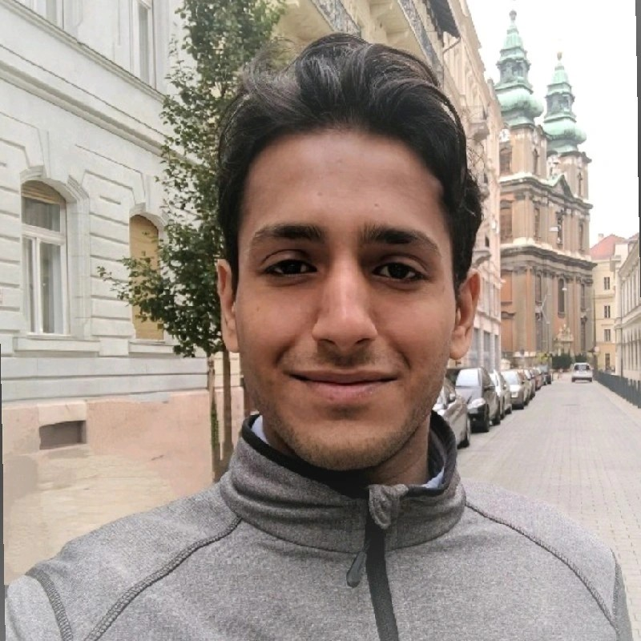

    

I'm **Shahbaz Chaudhry**, a data-driven problem solver with a robust background in scientific research and data science. I have used techniques including time seires anaysis, machine learning and geospation analysis. My current role gives me practical skills in building web-based data dashboards with plotly dash, data engineering and cloud solutions. Throughout my career, I’ve worked on interdisciplinary projects, ranging from government-driven data solutions to answering challenging research question with data. 

With a Ph.D. in astrophysics, I leverage advanced data science techniques to deliver actionable insights in network analysis, legislative modeling, natural language processing. I’m passionate about driving real-world outcomes with innovative technology, recently demonstrated by my contribution to a  **Top 3 placement** in a UK government data science hackathon, where I helped developed an agent-based LLM application, which is to be used in production.

Collaboration with stakeholders is central to my work, allowing me to bridge the gap between technical implimentors and non technical strategic decision-makers . I combine analytical rigor, practical implementation, and clear communication, ensuring that complex data is not only accessible but impactful.

Whether you’re looking to enhance data-driven decisions, streamline processes, or gain a fresh perspective on challenging issues, I’m here to help make it happen.

---

Feel free to reach out or connect with me on [LinkedIn](https://www.linkedin.com/in/shahbaz-chaudhry-phd-7b5557b7/?originalSubdomain=uk).